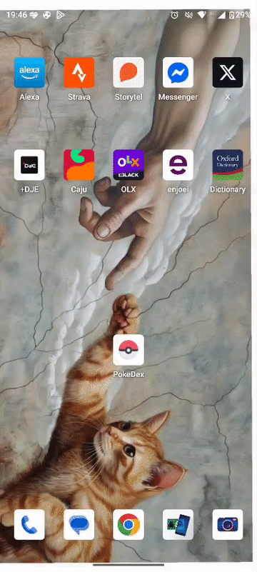
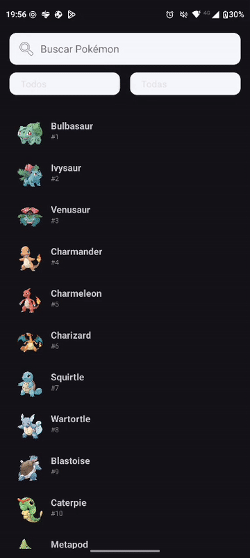
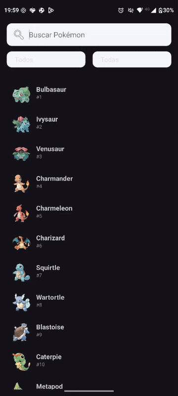
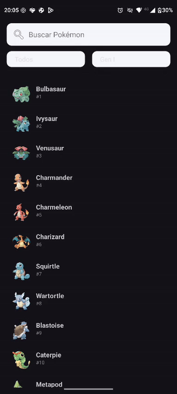

# PokéDex Android

Uma Pokédex simples em **Kotlin** que busca Pokémons na **PokéAPI**, permite **filtrar por tipo e geração** e mostra **detalhes** (tipos, stats, altura/peso, arte oficial).

## ✨ Funcionalidades
- **Busca por nome** com atualização imediata.
- **Filtros combináveis**: tipo e geração.
- **Tela de detalhes** com informações essenciais.
- **Lista leve** com imagens carregadas sob demanda.

## 🖼️ Telas 
**Abertura / Splash**  

**Lista e Busca**  

**Detalhes**  

**Filtro por Tipo**  

**Filtro por Geração**  

## ⚙️ Tecnologias
**Kotlin**, **Android**, **RecyclerView**, **ViewModel/Livedata**, **Retrofit/OkHttp/Moshi**, **Coil**.

## ▶️ Como executar (rápido)
1. Abrir no **Android Studio**.
2. Sincronizar **Gradle**.
3. Rodar em **emulador** ou **dispositivo** Android 7.0+.

